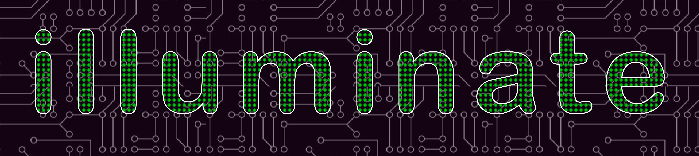

# Illuminate - Open-source LED array controller firmware
Illuminate was designed to standardize the interface and functionality of LED array illuminators for optical microscopy.

## Install (Cross-platform)
1. Install [Arduino](https://www.arduino.cc/) software
2. Install [Teensyduino](https://www.pjrc.com/teensy/td_download.html) software (If using a teensy micro-controller)
3. If needed, install git. See [This Tutorial](https://git-scm.com/book/en/v2/Getting-Started-Installing-Git)
4. Check out the illuminate repostory:
```bash
  git clone https://github.com/zfphil/illuminate.git
```
5. Check out the TLC5955 submodule (LED driver chips used for our devices)
```bash
  cd illuminate
  git submodule init
  git submodule update
```
6. open illuminate.ino in Arduino software
7. Ensure correct device is selected in the `illuminate.h` file by uncommenting the appropriate `#define USE_*` line. Ensure only one of these lines is uncommented.
8. Select micro-controller from Tools -> Board, select port from Tools -> Port. If a port says "Teensy", this is usually the correct port to use.
9. Open Serial Monitor (Tools -> Serial Monitor), set line ending to Newline and baud rate to 115200 (default)
10. Press upload to load code onto Teensy. You may need to press the white button on the top of the micro-controller to trigger the upload.
11. Type command (ex: "bf") and press enter to send

## Interfaces
All commands are sent over a serial (COM) port using a default baud rate of `115200`, and otherwise default settings. There are several ways to control these LED Arrays:
- The Serial Monitor within the [Arduino IDE](https://www.arduino.cc/en/software)
- The [Micro-Manager](https://micro-manager.org/Micro-Manager_Nightly_Builds) IlluminateLedArray Driver (nightly builds since 2019)
- MATLAB and python via modules within the [The Illuminate Controller Repository](http://www.github.com/zfphil/illuminate_controller)
- Any standard serial library within other languages (C++, java, etc.)

## Commands
Command help can be accessed by typing "?" into the Arduino terminal. These are also copied at the end of this file (see below) for convenience.
Static patterns may be 

#### Triggering and Sequences
While patterns may be executed statically using commands such as `bf` (brightfield), `df` (darkfield), or `dpc.t` (DPC Top), this firmware provides a sequencing interface which enables hardware-limited pattern updates as well as triggering support.
Illuminate supports several pre-defined pattern sequences:
- `scf`: Scan all LEDs, one at a time
- `scb`: Scan all brightfield LEDs (within the na set by the `na` command)
- `scd`: Scan all darkfield LEDs (within the na set by the `na` command)
- `rdpc`: Scan four half-circle "DPC" patterns (within the na set by the `na` command)

For all patterns, a delay betweenn pattern updates may be set using the first argument (e.g. `scf.500` will provide 500ms delay. Multiple pattern cycles may be kicked off using the second argument (e.g. `scf.0.2` will cycle through two patterns as fast as possible).
Custom pattern sequences are also supported. See the `ssl`, `ssv`, `pseq`, and `rseq` commands below for more information.

To enable triggering using SMA ports on the side of devices, The `tim` (trigger input mode) and `tom` (trigger output mode) commands can be used.
The first argument is the trigger number (`0` or `1`), and the second argument is the mode:
- `-2`: One pulse at the start of the first pattern cycle. Even if multiple pattern cycles are provided (second argument above), only one trigger pulse is sent.
- `-1`: One pulxe at the start of each pattern sequence
- `0`: This sequence will not wait for or emit any trigger signals
- `1`: Emit or wait for one trigger pulse per pattern update.
- `2`, `3`, `4`, ... `N`: Emit or wait for one trigger pulse per every `N` pattern updates.

Trigger inputs and outputs use the same mode strings. Note that trigger inputs will wait up to the timeout set in `trinputtimeout` before erroring (30s is the default).
Trigger polarity, pulse width, and short delays may be set via the api described below.

Sending any serial command will halt a sequence (and discard that command, which will need to be re-sent to take effect).

## Devices
This project is designed for led arrays which are controlled by a Teensy 3.2, Teensy 4.0, or Teensy 4.1 micro-controller. Additional micro-controllers should be easy to support if pins are configured correctly.

#### Currently supported devices
- Quasi-Dome Illuminator (Waller Lab, UC Berkeley)
- Direct LED connection array (Waller Lab, UC Berkeley)
- sci.round ([SCI Microscopy](https://sci-microscopy.com))
- sci.dome ([SCI Microscopy](https://sci-microscopy.com))
- Various custom devices by [SCI Microscopy](https://sci-microscopy.com)

#### Adding New Devices
New devices are created by adding a new .cpp file to the root directory of the project and providing functions for the LedArrayInterface class. Static variables within this class must also be defined in the cpp file (including LED positions, trigger ports, etc.).

## License
```
/*
  Copyright (c) 2021, Zack Phillips
  Copyright (c) 2018, Zachary Phillips (UC Berkeley)
  All rights reserved.

  BSD 3-Clause License

  Redistribution and use in source and binary forms, with or without
  modification, are permitted provided that the following conditions are met:
      Redistributions of source code must retain the above copyright
      notice, this list of conditions and the following disclaimer.
      Redistributions in binary form must reproduce the above copyright
      notice, this list of conditions and the following disclaimer in the
      documentation and/or other materials provided with the distribution.
      Neither the name of the Zachary Phillips nor the
      names of its contributors may be used to endorse or promote products
      derived from this software without specific prior written permission.

  THIS SOFTWARE IS PROVIDED BY THE COPYRIGHT HOLDERS AND CONTRIBUTORS "AS IS" AND
  ANY EXPRESS OR IMPLIED WARRANTIES, INCLUDING, BUT NOT LIMITED TO, THE IMPLIED
  WARRANTIES OF MERCHANTABILITY AND FITNESS FOR A PARTICULAR PURPOSE ARE
  DISCLAIMED. IN NO EVENT SHALL ZACHARY PHILLIPS BE LIABLE FOR ANY
  DIRECT, INDIRECT, INCIDENTAL, SPECIAL, EXEMPLARY, OR CONSEQUENTIAL DAMAGES
  (INCLUDING, BUT NOT LIMITED TO, PROCUREMENT OF SUBSTITUTE GOODS OR SERVICES;
  LOSS OF USE, DATA , OR PROFITS; OR BUSINESS INTERRUPTION) HOWEVER CAUSED AND
  ON ANY THEORY OF LIABILITY, WHETHER IN CONTRACT, STRICT LIABILITY, OR TORT
  (INCLUDING NEGLIGENCE OR OTHERWISE) ARISING IN ANY WAY OUT OF THE USE OF THIS
  SOFTWARE, EVEN IF ADVISED OF THE POSSIBILITY OF SUCH DAMAGE.
*/
```

## Contributions
Pull requests will be reviewed as received, and are encouraged!

## API Reference
-----------------------------------
Command List:
-----------------------------------
COMMAND: 
  about
SYNTAX:
  about
DESCRIPTION:
  Displays information about this device
-----------------------------------
COMMAND: 
  reset
SYNTAX:
  reboot
DESCRIPTION:
  Runs setup routine again, for resetting LED array
-----------------------------------
COMMAND: 
  version
SYNTAX:
  version
DESCRIPTION:
  Display controller version number
-----------------------------------
COMMAND: 
  license
SYNTAX:
  license
DESCRIPTION:
  Display software license for firmware residing on this teensy
-----------------------------------
COMMAND: 
  ?
SYNTAX:
  license
DESCRIPTION:
  Display human-readable help information.
-----------------------------------
COMMAND: 
  store
SYNTAX:
  store
DESCRIPTION:
  Store device parameters
-----------------------------------
COMMAND: 
  recall
SYNTAX:
  recall
DESCRIPTION:
  Recall stored device parameters
-----------------------------------
COMMAND: 
  autoload
SYNTAX:
  autoload [or] autoload.1
DESCRIPTION:
  Toggle/set whether previously stored settings are loaded on power-up. Value is persistant.
-----------------------------------
COMMAND: 
  ac
SYNTAX:
  ac --or-- ac.[0/1]
DESCRIPTION:
  Toggle clearing of array between led updates. Calling without options toggles the state.
-----------------------------------
COMMAND: 
  na
SYNTAX:
  na.[na*100]
DESCRIPTION:
  Set na used for bf/df/dpc/cdpc patterns
-----------------------------------
COMMAND: 
  nai
SYNTAX:
  nai.20
DESCRIPTION:
  Sets the inner NA. (nai.20 sets an inner NA of 0.20)  Respected by bf, dpc, and rdpc commands. Default is 0
-----------------------------------
COMMAND: 
  sc
SYNTAX:
  sc.[`red` or `green` or `blue` or `white`] --or-- sc.[red_value].[green_value].[blue_value].
DESCRIPTION:
  Set LED array color balance (RGB arrays only). Note values are normalized to current brightness (set by the `sb` command)
-----------------------------------
COMMAND: 
  ssc
SYNTAX:
  ssc.[channel index].[color]
DESCRIPTION:
  Set single color channel by index
-----------------------------------
COMMAND: 
  sb
SYNTAX:
  sb.[rgbVal] --or-- sb.[rVal].[gVal].[bVal]
DESCRIPTION:
  Set LED array brightness
-----------------------------------
COMMAND: 
  sad
SYNTAX:
  sad.[dist (mm)]
DESCRIPTION:
  Set LED array distance
-----------------------------------
COMMAND: 
  l
SYNTAX:
  l.[led #].[led #], ...
DESCRIPTION:
  Turn on a single LED (or multiple LEDs in a list)
-----------------------------------
COMMAND: 
  x
SYNTAX:
  x
DESCRIPTION:
  Clear the LED array.
-----------------------------------
COMMAND: 
  gs
SYNTAX:
  gs.0 --or-- gs.1
DESCRIPTION:
  Set the global shutter state to open (1) or closed (0), maintaining all other settings
-----------------------------------
COMMAND: 
  ff
SYNTAX:
  ff
DESCRIPTION:
  Fill the LED array with default color.
-----------------------------------
COMMAND: 
  bf
SYNTAX:
  bf
DESCRIPTION:
  Display brightfield pattern
-----------------------------------
COMMAND: 
  df
SYNTAX:
  df
DESCRIPTION:
  Display darkfield pattern
-----------------------------------
COMMAND: 
  dpc
SYNTAX:
  dpc.[t/b/l/r] --or-- dpc.[top/bottom/left/right] --or-- dpc (will raw first pattern)
DESCRIPTION:
  Illuminate half-circle (DPC) pattern
-----------------------------------
COMMAND: 
  cdpc
SYNTAX:
  cdpc.[rVal].[gVal].[bVal]) --or-- cdpc.[rgbVal]) --or-- cdpc
DESCRIPTION:
  Illuminate color DPC (cDPC) pattern
-----------------------------------
COMMAND: 
  an
SYNTAX:
  an.[minNA*100].[maxNA*100]
DESCRIPTION:
  Display annulus pattern set by min/max na
-----------------------------------
COMMAND: 
  ha
SYNTAX:
  ha.[type].[minNA*100].[maxNA*100]
DESCRIPTION:
  Illuminate half annulus
-----------------------------------
COMMAND: 
  dq
SYNTAX:
  dq --or-- dq.[quadrant index]
DESCRIPTION:
  Draws single quadrant
-----------------------------------
COMMAND: 
  cdf
SYNTAX:
  cdf.[rVal].[gVal].[bVal]) --or-- cdf.[rgbVal]) --or-- cdf
DESCRIPTION:
  Draws color darkfield pattern
-----------------------------------
COMMAND: 
  scf
SYNTAX:
  scf.[(Optional - default=0) Delay between each pattern in ms].[(Optional - default=1) Number of times to execute sequence]
DESCRIPTION:
  Scan all active LEDs. May emit or wait for trigger signals depending on trigger settings. If update speed is too fast, a warning message will print.
-----------------------------------
COMMAND: 
  scb
SYNTAX:
  scb.[(Optional - default=0) Delay between each pattern in ms].[(Optional - default=1) Number of times to execute sequence]
DESCRIPTION:
  Scan all brightfield LEDs. May emit or wait for trigger signals depending on trigger settings. If update speed is too fast, a warning message will print.
-----------------------------------
COMMAND: 
  scd
SYNTAX:
  scb.[(Optional - default=0) Delay between each pattern in ms].[(Optional - default=1) Number of times to execute sequence]
DESCRIPTION:
  Scan all darkfield LEDs. May emit or wait for trigger signals depending on trigger settings. If update speed is too fast, a warning message will print.
-----------------------------------
COMMAND: 
  ssl
SYNTAX:
  ssl.[Sequence length]
DESCRIPTION:
  Set sequence length, or the number of patterns to be cycles through (not the number of leds per pattern).
-----------------------------------
COMMAND: 
  ssv
SYNTAX:
  ssl.[# Number of LEDs], [LED number 0], [LED number 1]], [LED number 2], ...
DESCRIPTION:
  Set sequence value
-----------------------------------
COMMAND: 
  rseq
SYNTAX:
  rseq.[(Optional - default=0) Delay between each pattern in ms].[(Optional - default=1) Number of times to execute sequence]
DESCRIPTION:
  Runs sequence with specified delay between each update. May emit or wait for trigger signals depending on trigger settings. If update speed is too fast, a warning message will print.
-----------------------------------
COMMAND: 
  pseq
SYNTAX:
  pseq
DESCRIPTION:
  Prints sequence values to the terminal
-----------------------------------
COMMAND: 
  sseq
SYNTAX:
  sseq
DESCRIPTION:
  Manually step through a sequence, incrementing the current index. May emit or wait for trigger signals depending on trigger settings.
-----------------------------------
COMMAND: 
  xseq
SYNTAX:
  xseq
DESCRIPTION:
  Resets sequence index to the first value, leaving the sequence unchanged.
-----------------------------------
COMMAND: 
  rdpc
SYNTAX:
  rdpc.[(Optional - default=0) Delay between each pattern in ms].[(Optional - default=1) Number of times to execute sequence]
DESCRIPTION:
  Runs a DPC sequence with specified delay between each update. May emit or wait for trigger signals depending on trigger settings. If update speed is too fast, a warning message will print.
-----------------------------------
COMMAND: 
  tr
SYNTAX:
  tr.[trigger index]
DESCRIPTION:
  Output TTL trigger pulse to camera
-----------------------------------
COMMAND: 
  trs
SYNTAX:
  trs.[trigger index].[trigger pin index].['trigger delay between H and L pulses]
DESCRIPTION:
  Set up hardware (TTL) triggering
-----------------------------------
COMMAND: 
  trt
SYNTAX:
  trt.[trigger input index]
DESCRIPTION:
  Waits for trigger pulses on the defined channel
-----------------------------------
COMMAND: 
  ch
SYNTAX:
  dc.[led#]
DESCRIPTION:
  Draw LED by hardware channel (use for debugging)
-----------------------------------
COMMAND: 
  debug
SYNTAX:
  dbg.[command router debug].[LED array (generic) debug].[LED interface debug] --or-- dbg (toggles all between level 1 or 0)
DESCRIPTION:
  Toggle debug flag. Can call with or without options.
-----------------------------------
COMMAND: 
  spo
SYNTAX:
  spo.[rChan].[gChan].[bChan] --or-- spo.[led#].[rChan].[gChan].[bChan]
DESCRIPTION:
  Sets pin order (R/G/B) for setup purposes. Also can flip individual leds by passing fourth argument.
-----------------------------------
COMMAND: 
  delay
SYNTAX:
  delay.[length of time in ms]
DESCRIPTION:
  Simply puts the device in a loop for the amount of time in ms
-----------------------------------
COMMAND: 
  mc
SYNTAX:
  mc.[current limit in amps]
DESCRIPTION:
  Sets/Gets max current in amps
-----------------------------------
COMMAND: 
  mce
SYNTAX:
  mce.[0, 1]
DESCRIPTION:
  Sets/Gets whether or not max current limit is enforced (0 is no, all other values are yes)
-----------------------------------
COMMAND: 
  pvals
SYNTAX:
  pvals
DESCRIPTION:
  Print led values for software interface
-----------------------------------
COMMAND: 
  pledpos
SYNTAX:
  pledpos
DESCRIPTION:
  Prints the positions of each LED in cartesian coordinates.
-----------------------------------
COMMAND: 
  pprops
SYNTAX:
  pprops
DESCRIPTION:
  Prints system parameters such as NA, LED Array z-distance, etc. in the format of a json file
-----------------------------------
COMMAND: 
  pledposna
SYNTAX:
  pledposna
DESCRIPTION:
  Prints the positions of each LED in NA coordinates (NA_x, NA_y, NA_distance
-----------------------------------
COMMAND: 
  disco
SYNTAX:
  disco.[Number of LEDs in pattern]
DESCRIPTION:
  Illuminate a random color pattern of LEDs
-----------------------------------
COMMAND: 
  demo
SYNTAX:
  demo
DESCRIPTION:
  Runs a demo routine to show what the array can do.
-----------------------------------
COMMAND: 
  water
SYNTAX:
  water
DESCRIPTION:
  Water drop demo
-----------------------------------
COMMAND: 
  sn
SYNTAX:
  sn
DESCRIPTION:
  Gets device serial number
-----------------------------------
COMMAND: 
  pn
SYNTAX:
  pn
DESCRIPTION:
  Gets device part number
-----------------------------------
COMMAND: 
  sbr
SYNTAX:
  sbr.1000000
DESCRIPTION:
  Sets SPI baud rate for TLC5955 Chips in Hz (baud)
-----------------------------------
COMMAND: 
  sgs
SYNTAX:
  sgs.1000000
DESCRIPTION:
  Sets GSCLK frequency in Hz
-----------------------------------
COMMAND: 
  human
SYNTAX:
  human
DESCRIPTION:
  Sets command mode to human-readable
-----------------------------------
COMMAND: 
  machine
SYNTAX:
  machine
DESCRIPTION:
  Sets command mode to machine-readable
-----------------------------------
COMMAND: 
  pwrs
SYNTAX:
  pwrs
DESCRIPTION:
  Toggle power source sensing on or off.
-----------------------------------
COMMAND: 
  pwrv
SYNTAX:
  pwrv
DESCRIPTION:
  Print power sourve voltage.
-----------------------------------
COMMAND: 
  trinputtimeout
SYNTAX:
  trinputtimeout.10
DESCRIPTION:
  Sets the trigger input timeout in seconds. Default is 60 (60s).
-----------------------------------
COMMAND: 
  troutputpulsewidth
SYNTAX:
  troutputpulsewidth.1000
DESCRIPTION:
  Sets the trigger pulse width in microseconds, default is 1000.
-----------------------------------
COMMAND: 
  trinputpolarity
SYNTAX:
  trinputpolarity.1
DESCRIPTION:
  Sets the trigger input polarity. 1=active high, 0=active low. Default is 1.
-----------------------------------
COMMAND: 
  troutputpolarity
SYNTAX:
  troutputpolarity.1
DESCRIPTION:
  Sets the trigger output polarity. 1=active high, 0=active low. Default is 1.
-----------------------------------
COMMAND: 
  troutputdelay
SYNTAX:
  troutputdelay.0
DESCRIPTION:
  Sets the trigger delay in microseconds. Default is zero.
-----------------------------------
COMMAND: 
  trinputpin
SYNTAX:
  trinputpin
DESCRIPTION:
  Returns the Teensy pin of the trigger inputsignal. Used only for debugging.
-----------------------------------
COMMAND: 
  troutputpin
SYNTAX:
  troutputpin
DESCRIPTION:
  Returns the Teensy pin of the trigger outputsignal. Used only for debugging.
-----------------------------------
COMMAND: 
  cos
SYNTAX:
  cos.2
DESCRIPTION:
  Returns or sets the cosine factor, used to scale LED intensity (so outer LEDs are brighter). Input is cos.[integer cosine factor]
-----------------------------------
COMMAND: 
  hwinit
SYNTAX:
  hwinit.[sn].[pn]
DESCRIPTION:
  Manufacturer hardware initialization. Modifies persistant settings - do not use unless you know what you're doing.
-----------------------------------
```